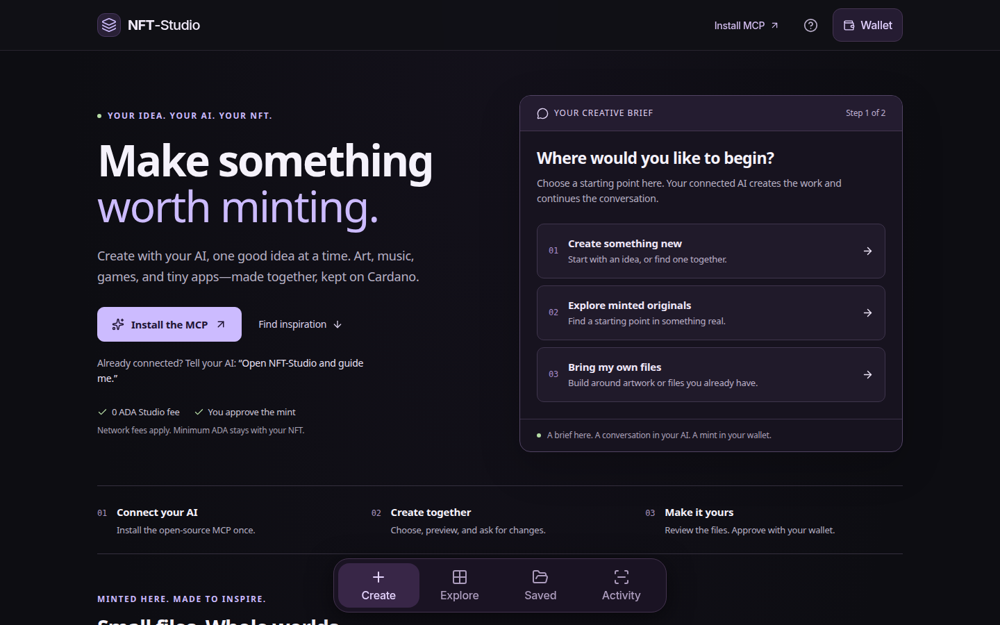

# NFT-Studio

[Open NFT Studio](https://beacnpool.github.io/NFT-Studio/) · [Build verification](https://github.com/BEACNpool/NFT-Studio/actions/workflows/verify.yml)

An **AI-driven creation studio for Cardano**. Connect your AI through the MCP,
shape an idea together, preview and revise the actual files, then approve the
mint in your own wallet. Create art, sound, playable games and useful apps—or
start with a previously minted original for inspiration.

**[Install the MCP](https://beacnpool.github.io/NFT-Studio/mcp/)** ·
**[Explore minted inspiration](https://beacnpool.github.io/NFT-Studio/#inspiration)** ·
[Interactive guide contract](docs/CREATIVE_GUIDE.md)

Ask your connected AI: **“Open NFT-Studio and guide me.”** The MCP offers a menu
and one question at a time, including preview, revision, pause and keeping files
without minting. Native question forms are used where the client supports them;
numbered chat menus work elsewhere. A complete one-prompt request works too.

The website helps visitors build a brief and copy it into their AI. It does not
run a hidden model or pretend its menu generates artwork. The AI creates the
media; the MCP guides, checks and packages exact bytes; the browser builds the
transaction for your visible wallet approval.



The existing browser editors remain under **Create directly in your browser**.
**Create, Explore, Saved and Activity** work on phone and desktop. Switching tabs
keeps an unsaved editor open, and browser Back/Forward follows the app screens.
Saved projects and receipts stay local to the browser and origin.

## BEACN Labs

[Open Labs](https://beacnpool.github.io/NFT-Studio/?view=labs) to explore working
tools and experimental contract technology:

Start with the [short Labs field guide](docs/LABS_FIELD_GUIDE.md) for a tour that
does not require a wallet.

| Lab | What works today |
| --- | --- |
| State capsule | Evolve an embedded artwork, inspect linked CIP-68 datum revisions, freeze and export its history. The one-shot Aiken contract has compiled Plutus V3 tests and independent node issuance evaluation. The browser demo is local; this is experimental contract code. |
| Contract compiler | Apply the fixed State Capsule program to an exact seed/name in the browser and export its blueprint, policy and paired asset names. 256 cases match the pinned Aiken CLI; this does not prepare a live mint. |
| Music release | Package exact audio, artwork and credits, review a music-aware native transaction in your wallet, and recover the complete release from its actual receipt metadata. A CIP-60-aligned extension; declarations do not configure royalty payments. |
| Release seal | Verify a Schnorr endorsement of exact music files and credits, compare the signed package with the current release, and apply separately selected key trust. A portable experimental sidecar, with local Aiken primitive checks; no identity or wallet authorization. |
| Proof of existence | Hash up to 16 local files incrementally, export exact label-309 metadata using the public hash-only profile of proposed CIP-190, and verify original bytes. Exporting does not publish a transaction. |
| Artifact passport | Turn an exact-file mint receipt into a portable content/evidence package, verify it offline, and optionally check the original transaction binding. Export directly from Activity or open one in Labs. |
| Knowledge | Search 58 curated research entries and a separate library of 148 original CIP documents. Inspect source text, licensing, lifecycle limits and pinned implementation evidence. Proposal status remains separate from adoption or tested behavior. |
| Asset inspector | Derive CIP-14 fingerprints, verify CIP-67 checksums and locate paired CIP-68 asset names from exact bytes. It does not assert chain existence or ownership. |
| Registry signatures | Inspect exact CIP-26 scalar signatures, compare signer keys with separately selected trust rules, and detect stale or conflicting sequence observations locally. |
| Agent minting | Ask your configured agent for a compact NFT, open its content-bound review link, inspect the files, then connect your wallet and approve the mint. JSON import remains available. |

The [repository-hosted MCP setup page](https://beacnpool.github.io/NFT-Studio/mcp/)
shows how to run **21 tools and 61 resources locally from this repo**: Cardano knowledge,
original CIP source access, exact files and music packages, fixed Capsule parameters,
unsigned transactions and external witness verification. Your wallet retains signing
authority. The setup page is not an HTTP MCP endpoint; operators can separately deploy
the 19-tool Worker on their own HTTPS host. [Connection guide](docs/MCP.md#public-connection). The [knowledge repository](knowledge/)
is reusable data with source hashes, attribution and an explicit evidence policy.

For Codex, the guide includes an installer and the repository’s `$nft-studio` skill.
The ordinary native mint charges **0 ADA Studio fee**; Cardano network fees apply,
and minimum ADA stays with the NFT in your output. A real Codex session has created
and verified the direct review request; wallet signing and receipt handling have
passed synthetic browser tests. **Named-wallet acceptance and a confirmed live mint
remain the release gate.** See [the acceptance evidence](docs/AGENT_ACCEPTANCE.md).

Read [State Capsules](docs/STATE_CAPSULES.md),
[music formats and limits](docs/MUSIC_RELEASE.md),
[music receipt verification](docs/MUSIC_RECEIPTS.md),
[proof encoding and vectors](docs/PROOF_OF_EXISTENCE.md),
[knowledge architecture](docs/KNOWLEDGE_BASE.md), and
[148 original CIP documents](docs/CIP_SOURCE_ACCESS.md) before building on these tools.
These are implementations and research built on existing Cardano standards;
their individual evidence and open limitations are recorded in the repository.

[Artifact Passports](docs/ARTIFACT_PASSPORT.md) separate local byte checks from
receipt reports, chain inclusion and provenance claims. The experimental
[holder-proof verifier](experiments/holder-proof/) checks exact CIP-30 signatures,
challenge scope and supplied holding observations with replay protection. It is
offline research code; no holder authentication service has been deployed.

[Play Midnight Beacon](https://beacnpool.github.io/NFT-Studio/labs/midnight-beacon/) — an original eight-second chiptune and SVG cover in 8,600 raw bytes. Open its exact package in Music release; the [recipe and dated evidence](experiments/midnight-beacon-demo/) include complete synthetic transaction measurement. The example is unminted.

[Play Five Small Worlds](https://beacnpool.github.io/NFT-Studio/showcase/science-five/) — five interactive BEACN Labs studies: a crypto magic 8-ball, reaction–diffusion garden, chaotic pendulums, drawing-to-sound harmonics and cryptographic stained glass. Each contains working experiments, lessons and artwork export. [Source, math and verification](experiments/science-five/) include exact mint files and complete synthetic transaction measurements. The five original editions are minted and confirmed, with exact chain-recovery receipts and links to each original. Review files can mint separate copies.

## Open in VESPR

Open the Studio URL inside VESPR’s dApp browser. The app has touch-friendly
navigation and a visual Create → Details → Extras → Review flow. Wallet access
can be approved from the header; signing only happens at the final mint review.
The wallet dialog also offers an [open-in-wallet-browser link](https://cips.cardano.org/cip/CIP-0158)
and a copy-link fallback. Switching browsers transfers the URL, not local files or drafts.

The trusted embedded Scroll and Book creators can discover a same-origin parent’s
CIP-30 wallet, including late VESPR injection. Opaque artwork frames cannot access
that wallet. Source and browser tests use synthetic providers; actual VESPR device
acceptance is still required before retiring the original sites.

## Create

| Format | What you can do |
| --- | --- |
| Image & art | Upload an image, start from a blank canvas or generative artwork; draw, add text, compose, personalize, save and mint. |
| Ledger Scroll | Publish writing or a complete file, including multipart archives with resumable progress, receipts and byte recovery. Scroll storage does **not** create an NFT; its data outputs permanently lock ADA. |
| Ledger Book | Mint a Book and collect public entries and replies over time. Entries are open; this is not private or owner-only publishing. |
| Music & sound | Configure Beat Lab grooves, preview native synthesis, export WAV, attach the working synthesizer to a cover, or package a small audio file. |
| Playable games | Play and mint visitor copies of nine compact games. Download the complete programs, including STARFALL’s additional cartridges. |
| Useful apps | Configure Focus Capsule, Decision Deck and Beat Lab. Public, reusable programs run without a wallet and can be kept offline. |
| Motion & animation | Explore chain-recovered SVG animation, pixel films and WebGL originals; review exact compact moving media for a new file-based creation. |
| Files & data | Package up to eight exact files with an image-cover NFT, or publish a metadata record without minting a token. |

The showcase includes original transaction identities, exact media checksums,
seven configurable presets, three complete Harmonic Machines with composition, song codes and WAV/MIDI exports, historical editions, the fixed oligarCH holder-gated
maker, and attributed Tipsy Turtles demonstrations. Expired demo policies remain
historical. The original Ledger Chess referee remains unchanged.

The eight benefit blueprints cover membership, content, events, redemption,
evolving art, community voting, collaboration and loyalty. They can be designed
and exported; metadata alone does not activate those services or contracts.

## Review, sign, recover

- The connected visitor wallet owns new ordinary native policies and receives
  the creation. NFT Studio charges no platform fee; network fees and required
  asset ADA are shown separately. Specialty Ledger and legacy flows show their
  own protocol payments and rules.
- Native transactions use live network parameters and the visitor’s actual
  inputs. Existing tokens and ADA change are preserved. Datum/reference-script
  inputs are excluded from ordinary native minting.
- Review includes the exact compressed art or unchanged files, destination,
  fee, minting window and full signed transaction size. Witnesses, body and
  committed metadata are checked after signing.
- One token is minted by an ordinary native mint transaction. Its creator-signed
  policy may mint more until its window closes; it cannot mint **or burn** after
  closing. This is not an enforced lifetime supply cap.
- Ordinary Studio submissions persist a local attempt marker before broadcast
  and use Web Locks across tabs. An ambiguous response is checked by transaction
  ID instead of automatically resubmitted. Clearing site data or changing device
  is outside this local replay guard.
- Receipts, editable projects and files can be downloaded. Activity checks
  current chain inclusion and reconstructs embedded content. A hash match verifies
  bytes against their metadata commitment, not authorship or copyright.

Everything put on chain is public. Imported HTML is previewed inertly; its saved
and minted bytes remain exact. Known, hash-verified games and built-in apps use
separate opaque runners. Private keys never enter the application.

## Run locally

Node 22.13 or newer is required.

```sh
npm ci
npm run dev
```

No API key, backend signer or private hosting configuration is required.
The browser uses the public BEACN Koios endpoint for protocol parameters and
chain reads, and an explicitly selected CIP-30 wallet for signing/submission.

```sh
npm run typecheck
npm run lint
npm run verify:mint
npm run verify:design
npm run verify:interactive
npm run verify:games
npm run verify:studio
npm run verify:labs
npm run verify:knowledge
npm run verify:passport
npm run verify:capsules
node scripts/verify-mint-receipt.mjs
npm run build
```

`npm run build` produces the root deployment in `dist/client`.
`npm run build:pages` produces a GitHub Pages subdirectory export in
`dist/github-pages`, configured for `/NFT-Studio/`. **GitHub Pages publishes the
`gh-pages` branch at the repository’s public URL.** The `main` branch holds source;
CI verifies it and uploads a build artifact. A source push alone does not update
the live branch. See [publishing instructions](docs/PUBLISHING.md).
No secret belongs in a static build.

## What has been verified

The implementation has synthetic signing tests with real Cardano serialization,
transaction conservation and recovery checks, adversarial upload previews,
receipt persistence/reload checks, nine-game visitor-wallet fixtures, and Ledger
creator/recovery integration at both root and GitHub subpaths. Desktop and mobile
browser flows have been exercised. These tests use ephemeral synthetic wallets;
they do **not** claim a new real-wallet mainnet acceptance mint for this release.

Before retiring an existing site, complete real-wallet acceptance for each migrated
flow, retain exported receipts, and confirm the new public deployment’s recovery
path. The previous sites are not removed by this repository.

See [architecture and limits](docs/ARCHITECTURE.md),
[engine decisions](docs/STUDIO_ENGINE_RESEARCH.md),
[Ledger integration](docs/LEDGER_INTEGRATION.md),
[media catalogue](docs/MEDIA_CATALOG.md) and
[verification scope](docs/VERIFICATION.md).

## Attribution

Original BEACN source, documentation and knowledge summaries are available under
[Apache-2.0](LICENSE). See [NOTICE](NOTICE) for retained licenses and media
boundaries, and [CONTRIBUTING.md](CONTRIBUTING.md) to build on the work.

Created by BEACN from its BMKR / BEACN PRISM and Ledger projects. Ledger Scrolls
retains its upstream MIT license at `public/tools/ledger/LICENSE`. Original media,
collection attribution, game notices and existing policy identities remain with
their respective files. Code availability does not grant rights to third-party art.

## Send to mobile with a QR code

After the preview, choose **Send to mobile (QR)** or ask “Send this to my phone.”
The agent calls `create_mobile_handoff` with the exact verified ordinary intent
and displays its QR, complete HTTPS phone link and expiry. This uses the same
15-minute encrypted transfer as **Continue on phone → Create QR code** in Studio.
The local-file helper supports `--mobile` and saves PNG/SVG QR images and a phone
review page. Opening the link grants no wallet permission.

See [the native mobile workflow](docs/MOBILE_HANDOFF.md) for agent steps, saved files,
privacy, expiry and supported package limits.
