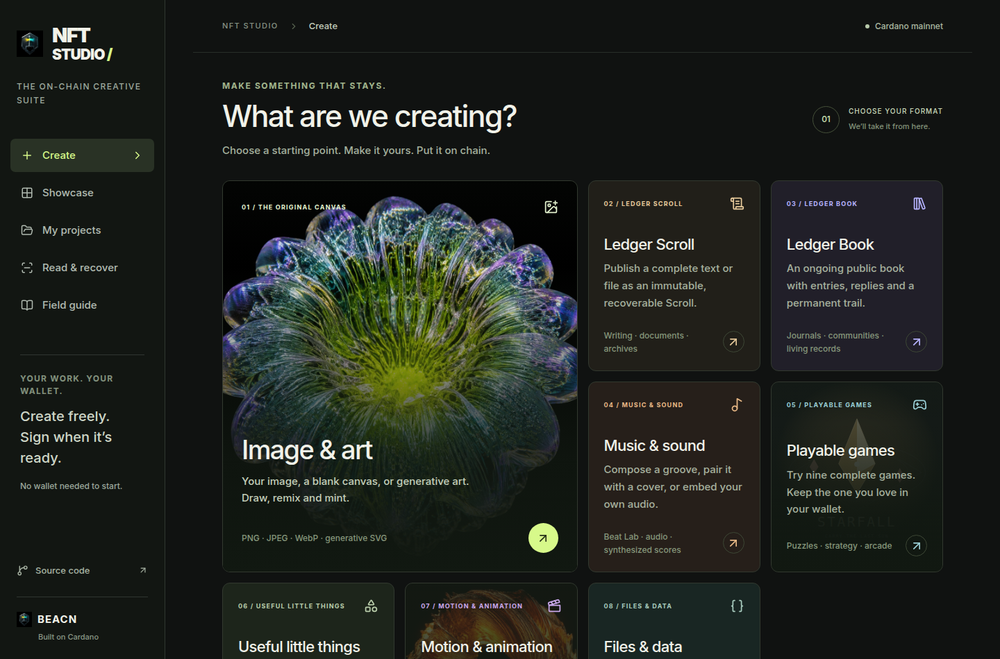

# NFT-Studio

[Open NFT Studio](https://beacnpool.github.io/NFT-Studio/) · [Build verification](https://github.com/BEACNpool/NFT-Studio/actions/workflows/verify.yml)

A mobile dApp and desktop creative workspace for putting the **actual content on Cardano**: art, sound,
playable games, useful apps, complete Ledger Scrolls and ongoing Ledger Books.
Start without a wallet. Build your creation, review the exact transaction, then
approve it in your wallet. NFT-Studio constructs the metadata from your visual creation and settings.



## Open in VESPR

Open the Studio URL inside VESPR’s dApp browser. The app has touch-friendly
navigation and a visual Create → Details → Extras → Review flow. Wallet access
can be approved from the header; signing only happens at the final mint review.
The wallet dialog also offers an [open-in-wallet-browser link](https://cips.cardano.org/cip/CIP-0158)
and a copy-link fallback. Switching browsers transfers the URL, not local files or drafts.

The trusted embedded Scroll and Book creators can discover a same-origin parent’s
CIP-30 wallet, including late VESPR injection. Opaque artwork frames cannot access
that wallet. Source and browser tests use synthetic providers; actual VESPR device
acceptance is still required before retiring the original sites.

## Create

| Format | What you can do |
| --- | --- |
| Image & art | Upload an image, start from a blank canvas or generative artwork; draw, add text, compose, personalize, save and mint. |
| Ledger Scroll | Publish writing or a complete file, including multipart archives with resumable progress, receipts and byte recovery. Scroll storage does **not** create an NFT; its data outputs permanently lock ADA. |
| Ledger Book | Mint a Book and collect public entries and replies over time. Entries are open; this is not private or owner-only publishing. |
| Music & sound | Configure Beat Lab grooves, preview native synthesis, export WAV, attach the working synthesizer to a cover, or package a small audio file. |
| Playable games | Play and mint visitor copies of nine compact games. Download the complete programs, including STARFALL’s additional cartridges. |
| Useful apps | Configure Focus Capsule, Decision Deck and Beat Lab. Public, reusable programs run without a wallet and can be kept offline. |
| Motion & animation | Explore chain-recovered SVG animation, pixel films and WebGL originals; review exact compact moving media for a new file-based creation. |
| Files & data | Package up to eight exact files with an image-cover NFT, or publish a metadata record without minting a token. |

The showcase includes original transaction identities, exact media checksums,
seven configurable presets, three complete Harmonic Machines with composition, song codes and WAV/MIDI exports, historical editions, the fixed oligarCH holder-gated
maker, and attributed Tipsy Turtles demonstrations. Expired demo policies remain
historical. The original Ledger Chess referee remains unchanged.

The eight benefit blueprints cover membership, content, events, redemption,
evolving art, community voting, collaboration and loyalty. They can be designed
and exported; metadata alone does not activate those services or contracts.

## Review, sign, recover

- The connected visitor wallet owns new ordinary native policies and receives
  the creation. NFT Studio charges no platform fee; network fees and required
  asset ADA are shown separately. Specialty Ledger and legacy flows show their
  own protocol payments and rules.
- Native transactions use live network parameters and the visitor’s actual
  inputs. Existing tokens and ADA change are preserved. Datum/reference-script
  inputs are excluded from ordinary native minting.
- Review includes the exact compressed art or unchanged files, destination,
  fee, minting window and full signed transaction size. Witnesses, body and
  committed metadata are checked after signing.
- One token is minted by an ordinary native mint transaction. Its creator-signed
  policy may mint more until its window closes; it cannot mint **or burn** after
  closing. This is not an enforced lifetime supply cap.
- Ordinary Studio submissions persist a local attempt marker before broadcast
  and use Web Locks across tabs. An ambiguous response is checked by transaction
  ID instead of automatically resubmitted. Clearing site data or changing device
  is outside this local replay guard.
- Receipts, editable projects and files can be downloaded. Activity checks
  current chain inclusion and reconstructs embedded content. A hash match verifies
  bytes against their metadata commitment, not authorship or copyright.

Everything put on chain is public. Imported HTML is previewed inertly; its saved
and minted bytes remain exact. Known, hash-verified games and built-in apps use
separate opaque runners. Private keys never enter the application.

## Run locally

Node 22.13 or newer is required.

```sh
npm ci
npm run dev
```

No API key, backend signer or private hosting configuration is required.
The browser uses the public BEACN Koios endpoint for protocol parameters and
chain reads, and an explicitly selected CIP-30 wallet for signing/submission.

```sh
npm run typecheck
npm run lint
npm run verify:mint
npm run verify:design
npm run verify:interactive
npm run verify:games
npm run verify:studio
node scripts/verify-mint-receipt.mjs
npm run build
```

`npm run build` produces the root deployment in `dist/client`.
`npm run build:pages` produces a GitHub Pages subdirectory export in
`dist/github-pages`, configured for `/NFT-Studio/`. **GitHub Pages publishes the
`gh-pages` branch at the repository’s public URL.** The `main` branch holds source;
CI verifies it and uploads a build artifact. A source push alone does not update
the live branch. See [publishing instructions](docs/PUBLISHING.md).
No secret belongs in a static build.

## What has been verified

The implementation has synthetic signing tests with real Cardano serialization,
transaction conservation and recovery checks, adversarial upload previews,
receipt persistence/reload checks, nine-game visitor-wallet fixtures, and Ledger
creator/recovery integration at both root and GitHub subpaths. Desktop and mobile
browser flows have been exercised. These tests use ephemeral synthetic wallets;
they do **not** claim a new real-wallet mainnet acceptance mint for this release.

Before retiring an existing site, complete real-wallet acceptance for each migrated
flow, retain exported receipts, and confirm the new public deployment’s recovery
path. The previous sites are not removed by this repository.

See [architecture and limits](docs/ARCHITECTURE.md),
[engine decisions](docs/STUDIO_ENGINE_RESEARCH.md),
[Ledger integration](docs/LEDGER_INTEGRATION.md),
[media catalogue](docs/MEDIA_CATALOG.md) and
[verification scope](docs/VERIFICATION.md).

## Attribution

Created by BEACN from its BMKR / BEACN PRISM and Ledger projects. Ledger Scrolls
retains its upstream MIT license at `public/tools/ledger/LICENSE`. Original media,
collection attribution, game notices and existing policy identities remain with
their respective files. Code availability does not grant rights to third-party art.
